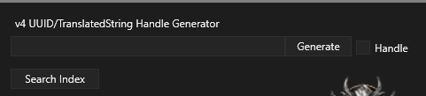
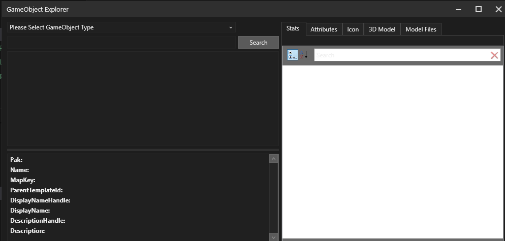
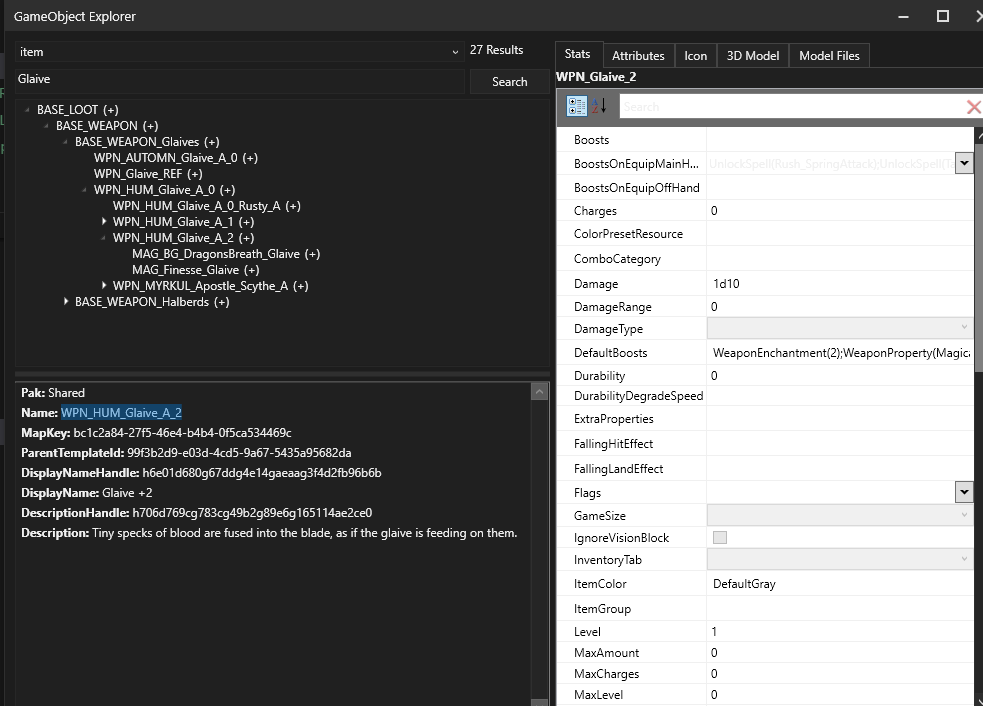
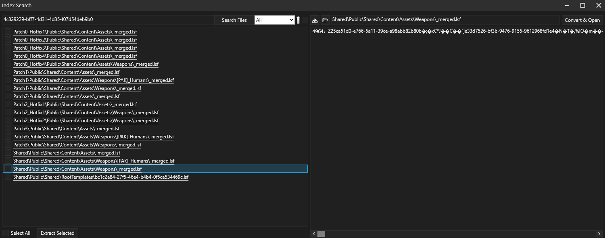
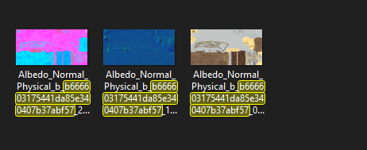

# Recoloring Vanilla Weapons
Below is a guide for changing the textures of vanilla weapons. I'll do my best to include as much information as possible, but if you get stuck, head on over to #bg3-mods-general in the Larian Studios Discord server. Even if I'm not around, they should be able to answer any questions.  
  
__I will be using the model of the Glaive +2 item as the basis of this tutorial, however the process will be almost the same for whichever weapon you choose. The name of my mod will be Glaive Revamped, but of course substitute that for the name of your mod.__

## Setting Up Your Workspace
For the tutorial you will need at a minimum:  
* A text editor
* Photo editing tools(I will be using GIMP)
* The modders' multitool
* Converter App  
  
Links to the tools can be found on [here](/bg3modresources/creating/#tools)

Also you will need to create a specific folder structure. I have released a python script that can generate a basic structure, but I will also write it out here.

```
<ModName>  
├───Generated
│   └───Public  
│       └───Shared  
│           └───Assets  
│               └───Weapons   
│  
├───Localization
│   └───English
├───Mods
│   └───<ModName>                            
└───Public
    └───<ModName>
        ├───Content
        │   └───Assets
        │       └───Weapons
        │           └───[PAK]_Weapons
        ├───RootTemplates
        └───Stats
            └───Generated
                └───Data
```
You don't need to create all of these now, but keep this in mind when following this guide. For now, create the Localization folder tree, the Mods/Modname folders, and Public/RootTemplates folders.

## How to Generate new UUIDs and Handles

Before we really get into the creation of the mod, the first thing that you should know how to do is creating new UUIDs and handles.

1. Open up the Modders Multitool, and you should see a box that looks likes this:  
   
2. To generate a new UUID, simply click the Generate button, and then click inside the box. It will copy the UUID to the ckeyboard. To generate handles, simply check the Handle box and repeat the same process as with UUIDs.  
    *Note: Make sure to only have the Handle box checked when generating handles for Localization.*

## Meta.Lsx

The very first file to edit will me the `meta.lsx` file inside of the folder `Glaive_Revamped\Mods\Glaive_Revamped\meta.lsx`. This is where the general information about your mod is stored. Here are the contents of the file:  
```xml
<?xml version="1.0" encoding="UTF-8"?>
    <save>
    <version major="4" minor="0" revision="9" build="331"/>
    <region id="Config">
        <node id="root">
            <children>
                <node id="Dependencies"/>
                    <node id="ModuleInfo">
                        <attribute id="Author" type="LSWString" value=""/>  CHANGE THIS
                        <attribute id="CharacterCreationLevelName" type="FixedString" value=""/>
                        <attribute id="Description" type="LSWString" value=""/> CHANGE THIS
                        <attribute id="Folder" type="LSWString" value=""/>  CHANGE THIS
                        <attribute id="GMTemplate" type="FixedString" value=""/>
                        <attribute id="LobbyLevelName" type="FixedString" value=""/>
                        <attribute id="MD5" type="LSString" value=""/>
                        <attribute id="MainMenuBackgroundVideo" type="FixedString" value=""/>
                        <attribute id="MenuLevelName" type="FixedString" value=""/>
                        <attribute id="Name" type="FixedString" value=""/>  CHANGE THIS
                        <attribute id="NumPlayers" type="uint8" value="4"/>
                        <attribute id="PhotoBooth" type="FixedString" value=""/>
                        <attribute id="StartupLevelName" type="FixedString" value=""/>
                        <attribute id="Tags" type="LSWString" value=""/>
                        <attribute id="Type" type="FixedString" value="Add-on"/>
                        <attribute id="UUID" type="FixedString" value=""/>
                        <attribute id="Version64" type="int64" value="36028797018963968"/>
                        <children>
                            <node id="PublishVersion">
                                <attribute id="Version64" type="int64" value="36028797018963968"/>
                            </node>
                            <node id="Scripts"/>
                            <node id="TargetModes">
                                <children>
                                    <node id="Target">
                                        <attribute id="Object" type="FixedString" value="Story"/>
                                    </node>
                                </children>
                            </node>
                        </children>
                    </node>
                </children>
            </node>
        </region>
    </save>
```

We will make the follow changes to this:
1. Change the value of the Author attribute to your name, in my case I'll set it to Faane.
2. Change the value of Description to whatever you want to description to be.
3. Make sure the folder is set to the name of your folder. Here it will be `Glaive_Revamped`. 
   - Make sure there are no spaces/special characters apart from _.
4. Set the name to the name of your mod, so `Glaive Revamped.`
5. Create a UUID using the multitool and paste it into the value field for UUID.
6. The only other field you might change in this file is Version64, which changes the version of the mod. There is a utility in the multitool for figuring out the number to put here, but know for now that it is set to `1.0.0.0`.  
  
You should now have a `meta.lsx` file that has contents similiar to this:  
```xml
<attribute id="Author" type="LSWString" value="Faane"/>
<attribute id="CharacterCreationLevelName" type="FixedString" value=""/>
<attribute id="Description" type="LSWString" value="A recolored version of Glaive +2"/>
<attribute id="Folder" type="LSWString" value="Glaive_Revamped"/>
<attribute id="GMTemplate" type="FixedString" value=""/>
<attribute id="LobbyLevelName" type="FixedString" value=""/>
<attribute id="MD5" type="LSString" value=""/>
<attribute id="MainMenuBackgroundVideo" type="FixedString" value=""/>
<attribute id="MenuLevelName" type="FixedString" value=""/>
<attribute id="Name" type="FixedString" value="Glaive Revamped"/>
<attribute id="NumPlayers" type="uint8" value="4"/>
<attribute id="PhotoBooth" type="FixedString" value=""/>
<attribute id="StartupLevelName" type="FixedString" value=""/>
<attribute id="Tags" type="LSWString" value=""/>
<attribute id="Type" type="FixedString" value="Add-on"/>
<attribute id="UUID" type="FixedString" value="873d534e-8168-459a-b140-8e448d356bf1"/>
<attribute id="Version64" type="int64" value="36028797018963968"/>
```

This file is done, and you can more or less forget about it for the duration of this tutorial.

## Localization File

Next step is to set up your localization file. This is located at: `Glaive_Revamped\Localization\English\Glaive_Revamped.loca.xml`.

The layout of this file is as follows:

```xml
<?xml version="1.0" encoding="utf-8"?>
<contentList>
	<content contentuid="" version="1"></content>
	<content contentuid="" version="1"></content>
</contentList>
```

Each line in this file will be some sort of text used in your mod. In your case, the first line will be the name of the item, and the second will be the description that shows in the tooltip.

1. Generate a handle for each `contentuid` field.
2. Place the text for the name and description between the opening and closing content tags.
  
Your file should look something like this:
```xml
<?xml version="1.0" encoding="utf-8"?>
<contentList>
	<content contentuid="hfc497768g1352g4f5agacbegdd8fcf52e613" version="1">My New Glaive</content>
	<content contentuid="hdd52a424gaeeag4cedg8f43gba7eed9a8e13" version="1">A recolored Glaive.</content>
</contentList>
```
  
Save the file, but keep it open, as we will need the handles we generated in the next step.

## RootTemplate Creation

The RootTemplate is file that ties all of your mod together. If your mod isn't working, 75% of the time it is an issue with the RootTemplate. 

The file will start out looking something like this:  
```xml
<?xml version="1.0" encoding="utf-8"?>
<save>
    <version major="4" minor="0" revision="9" build="328" lslib_meta="v1,bswap_guids" />
    <region id="Templates">
        <node id="Templates">
            <children>
                <node id="GameObjects">
                    <attribute id="CanShootThrough" type="bool" value="True" />
                    <attribute id="Description" type="TranslatedString" handle="" version="1" /> Handle from localization file.
                    <attribute id="DisplayName" type="TranslatedString" handle="" version="1" /> Handle from localization file.
                    <attribute id="EquipmentTypeID" type="guid" value="" />
                    <attribute id="Flag" type="int64" value="0" />
                    <attribute id="Icon" type="FixedString" value="<Icon_Name>" />
                    <attribute id="IsInspector" type="bool" value="True" />
                    <attribute id="LevelName" type="FixedString" value="" />
                    <attribute id="LevelOverride" type="int64" value="-1" />
                    <attribute id="MapKey" type="FixedString" value="" /> Generate new UUID.
                    <attribute id="Name" type="LSString" value="" />
                    <attribute id="ParentTemplateId" type="FixedString" value="" />
                    <attribute id="PhysicsTemplate" type="FixedString" value="" />
                    <attribute id="Race" type="int8" value="0" />
                    <attribute id="ReadinessFlags" type="uint32" value="144" />
                    <attribute id="Stats" type="FixedString" value="" />
                    <attribute id="Tooltip" type="uint8" value="2" />
                    <attribute id="Type" type="FixedString" value="item" />
                    <attribute id="VisualTemplate" type="FixedString" value="" />
                    <attribute id="WalkThrough" type="bool" value="True" />
                    <attribute id="_OriginalFileVersion_" type="int64" value="144115188075855912" />
                    <children>
                        <node id="GameMaster" />
                        <node id="OnDestroyActions">
                            <children>
                                <node id="Action">
                                    <attribute id="ActionType" type="int64" value="26" />
                                    <children>
                                        <node id="Attributes">
                                            <attribute id="ActivateSoundEvent" type="FixedString" value="3ea82655-5140-4287-9ab8-794559f182d3" />
                                            <attribute id="Animation" type="FixedString" value="" />
                                            <attribute id="PlayOnHUD" type="bool" value="False" />
                                        </node>
                                    </children>
                                </node>
                            </children>
                        </node>
                    </children>
                </node>
            </children>
        </node>
    </region>
</save>
```

We can fill out some of the basic information here, and generate our UUID, but a lot of the information here will actually come from the game files. It is located at `Glaive_Revamped\Public\Glaive_Revamped\RootTemplates\merged.lsf.lsx`. The name and extension is important here, so make sure your's looks the same.
### Basic Information
1. Copy and paste the handles into the approriate areas of the template for DisplayName and Description.
2. Go to the multitool, and making sure the Handle box is *unchecked* generate a new UUID and paste it into the value for `MapKey`. This is the UUID you will use if you want to spawn the weapon into the game using the console.
3. Put a name for the item into the value for Name. This needs to have no spaces and consist of only letters. It is best to pick something to prefix it with to help make sure it is unique. I personally prefix all of mine with `FAA` but you can choose what works for you. I will be naming my item `FAA_Glaive_Revamped`.
4. Paste the value you used for name into the value for Stats.
   
Now my file will have these changes:  
```xml
<attribute id="CanShootThrough" type="bool" value="True" />
<attribute id="Description" type="TranslatedString" handle="hdd52a424gaeeag4cedg8f43gba7eed9a8e13" version="1" /> 
<attribute id="DisplayName" type="TranslatedString" handle="hfc497768g1352g4f5agacbegdd8fcf52e613" version="1" /> 
<attribute id="EquipmentTypeID" type="guid" value="" />
<attribute id="Flag" type="int64" value="0" />
<attribute id="Icon" type="FixedString" value="" />
<attribute id="IsInspector" type="bool" value="True" />
<attribute id="LevelName" type="FixedString" value="" />
<attribute id="LevelOverride" type="int64" value="-1" />
<attribute id="MapKey" type="FixedString" value="a619eb76-475b-4f36-a4ef-542d931f05ec" />
<attribute id="Name" type="LSString" value="FAA_Glaive_Revamped" />
<attribute id="ParentTemplateId" type="FixedString" value="" />
<attribute id="PhysicsTemplate" type="FixedString" value="" />
<attribute id="Race" type="int8" value="0" />
<attribute id="ReadinessFlags" type="uint32" value="144" />
<attribute id="Stats" type="FixedString" value="FAA_Glaive_Revamped" />
<attribute id="Tooltip" type="uint8" value="2" />
<attribute id="Type" type="FixedString" value="item" />
<attribute id="VisualTemplate" type="FixedString" value="" />
<attribute id="WalkThrough" type="bool" value="True" />
<attribute id="_OriginalFileVersion_" type="int64" value="144115188075855912" />
```
### ParentTemplateID, PhysicsTemplate, EquipmentTypeID and Icon

The next step of the process are locating some key pieces of information:
* ParentTemplateID
* PhysicsTEmplate
* EquipmentTypeID
* Icon  
*We will be using a vanilla icon here, which won't reflect our changes. Creating a new icon is beyond the scope of this tutorial, but there is a guide linked on this website if you wish to do that.*  

To find these pieces of information, open up the Multitool. Click the "Search Index" button and let it do its thing. It may take some time, so this is a good time to get up and stretch your legs. When it finishes it will open up a window, but close that as we will be using another function at this point.

1. With your Multitool open, go to `Utlities -> Game Object Explorer -> Open`. It will take a few moments to load everything here, so be patient.
2. Once it finishes, you should have a window that looks like this:

3. In the drop down, select `item` as the game object type. In the search field, put in the item you're looking for. In my case it will be "Glaive". click through the menu's until you find the item you're looking for. I want the Glaive +2, so I selected `WPN_HUM_Glaive_A_2`. You should get something like this:

4. Click the "Attributes" tab on the right, see more information regarding the weapon. We can find the following pieces: 
    * ParentTemplateID: `bc1c2a84-27f5-46e4-b4b4-0f5ca534469c`  
    * PhysicsTemplate: `5a6acc22-4359-0d52-0a08-a6ad2fb16f21`
    * EquipmentTypeID: `5e004b79-461d-4617-bb0f-eef0e0ae1232`
    * Icon: `Item_WPN_HUM_Glaive_A_2`
*Note: This is the `MapKey` for the Glaive here, because we want to make something based on this item, so we will inherit from it by setting it as our ParentTemplateID.*

With these pieces of information, go back to the Roottemplate(merged.lsf.lsx) and edit the apporiate fields:
```xml
...
<attribute id="EquipmentTypeID" type="guid" value="5e004b79-461d-4617-bb0f-eef0e0ae1232" />
...
<attribute id="Icon" type="FixedString" value="Item_WPN_HUM_Glaive_A_2" />
...
<attribute id="ParentTemplateId" type="FixedString" value="bc1c2a84-27f5-46e4-b4b4-0f5ca534469c" />
<attribute id="PhysicsTemplate" type="FixedString" value="5a6acc22-4359-0d52-0a08-a6ad2fb16f21" />
```

### Notes on VisualTemplate
Now we have all the pieces in our RootTemplate set except for `VisualTemplate`. This defines the model and textures that will be used by the weapon, which is what we will have to create for our edits. The VisualTemplate id for the glaive is `4c829229-bff7-4d31-4d35-f07d54deb9b0`. Note this down, but don't insert it into your RootTemplate.  
*Note: If for your particular weapon certain fields are missing, go up the tree in the Object explorer until you find the values you need. A lot of times, they are inherited from the ParentTemplate, so you need to go find that to get the information you need*

We will come back around to the VisualTemplate in a later section, next we will create the stats for the weapon.

## Stats

Next we will create the stats for the new weapon. This is a will go into `Weapon.txt` which will be placed at: `Glaive_Revamped\Public\Glaive_Revamped\Stats\Generated\Data\Weapon.txt`.

This is the entry for the Glaive at its most basic:
```
new entry "FAA_Glaive_Revamped"
type "Weapon"
using "WPN_Glaive_2"
data "RootTemplate" ""
```

The first line is for the name of the item, which must match the name in your RootTemplate.  
for data "RootTemplate" this is where you need to go back into your RootTemplate and copy the `MapKey`.  
The using "WPN_Glaive_2" means that I want to use the values present inside that entry in the game files.  
*Note: Finding these can be somewhat tricky. You can use the Index Search and look for the MapKey of the item or unpack the game files. There's plenty of guides online about this, as well as the discord to ask if you need help.*  

The completed entry will look like this:

```
new entry "FAA_Glaive_Revamped"
type "Weapon"
using "WPN_Glaive_2"
data "RootTemplate" "a619eb76-475b-4f36-a4ef-542d931f05ec"
```

However I want to add some magic damage and a Weapon Enchantment to my weapon, and I want to define the properties(such as Heavy, Magic, Reach etc). So I will edit the entry to:
```
new entry "FAA_Glaive_Revamped"
type "Weapon"
using "WPN_Glaive_2"
data "RootTemplate" "a619eb76-475b-4f36-a4ef-542d931f05ec"
data "DefaultBoosts" "WeaponEnchantment(2);WeaponProperty(Magical);WeaponDamage(1d4, Thunder)"
data "Weapon Properties" "Heavy;Reach;Twohanded;Melee;Dippable;Magical"
```

More information about possible entries for this as well as how to add things like abilities and passives is beyond the scope of this guide. Just note that this is where you would do such things.

Now we have everything in place except for the VisualTemplate. This is where we actually get into the textures.

## Creating the VisualTemplate

### Finding the Original Textures

First things first, we need to find the original textures for our weapon. This we will do with the `VisualTemplate` UUID we grabbed in the previous section. Here it is again: `4c829229-bff7-4d31-4d35-f07d54deb9b0`. We are going to insert this into the index search of the multitool.

1. Click the "Search Index" button in the multitool.
2. Paste the UUID into the search bar and hit Enter.
3. Once it finishes searching, you'll see a list of entries with that present. We want one that is either in `Shared` or `Gustav`. In this case, it is in `Shared`. Once you select the file, click 'Convert and Open." 

4. Once it opens, you'll see a large wall of text. Use Ctrl + F and enter the VisualTemplate ID into the bar. You're looking for an entry that looks like this:
```xml
...
<node id="Resource">
    <attribute id="AttachBone" type="FixedString" value="" />
    <attribute id="AttachmentSkeletonResource" type="FixedString" value="" />
    <attribute id="BlueprintInstanceResourceID" type="FixedString" value="" />
    <attribute id="BoundsMax" type="fvec3" value="0.07434686 0.04069942 0.9553176" />
    <attribute id="BoundsMin" type="fvec3" value="-0.1294605 -0.02832419 -2.142045" />
    <attribute id="Center" type="fvec3" value="-0.02755684 0.006187616 -0.5933637" />
    <attribute id="ClothColliderResourceID" type="FixedString" value="" />
    <attribute id="HairPresetResourceId" type="FixedString" value="" />
    <attribute id="HairType" type="uint8" value="0" />
    <attribute id="ID" type="FixedString" value="4c829229-bff7-4d31-4d35-f07d54deb9b0" />
    <attribute id="Initialized" type="bool" value="True" />
    <attribute id="Localized" type="bool" value="False" />
    <attribute id="MaterialType" type="uint8" value="4" />
    <attribute id="Name" type="LSString" value="WPN_HUM_Glaive_A_2" />
    <attribute id="NeedsSkeletonRemap" type="bool" value="False" />
    <attribute id="Radius" type="float" value="1.552414" />
    <attribute id="ScalpMaterialId" type="FixedString" value="" />
    <attribute id="SkeletonResource" type="FixedString" value="" />
    <attribute id="SkeletonSlot" type="FixedString" value="" />
    <attribute id="Slot" type="FixedString" value="Unassigned" />
    <attribute id="SoftbodyResourceID" type="FixedString" value="" />
    <attribute id="SourceFile" type="LSString" value="Generated/Public/Shared/Assets/Weapons/Resources/WPN_HUM_Glaive_A_2.GR2" />
    <attribute id="SupportsVertexColorMask" type="bool" value="False" />
    <attribute id="Template" type="FixedString" value="Generated/Public/Shared/Assets/Weapons/Resources/WPN_HUM_Glaive_A_2.Dummy_WPN_HUM_Glaive_A_2.0" />
    <attribute id="_OriginalFileVersion_" type="int64" value="144115203108241409" />
    <children>
        <node id="AnimationWaterfall">
            <attribute id="Object" type="FixedString" value="" />
        </node>
        <node id="Base" />
        <node id="Objects">
            <attribute id="LOD" type="uint8" value="0" />
            <attribute id="MaterialID" type="FixedString" value="83b29b95-838b-4ede-be76-d741249adce9" />
            <attribute id="ObjectID" type="FixedString" value="WPN_HUM_Glaive_A_2.WPN_HUM_Glaive_A_2_Mesh.0" />
            <attribute id="Physics" type="FixedString" value="" />
            <attribute id="Slot" type="FixedString" value="" />
        </node>
...
```

This is the VisualTemplate for the weapon, and you can verify that by looking at the name. It also gives the path of the GR2 file, which is the 3D model. We don't need that, however. 

The first thing we need here is the `MaterialID`, which will get us one step closer to finding the textures! Here it is `83b29b95-838b-4ede-be76-d741249adce9`. Using CTRL-F again, search for the ID in the file.
```xml
<node id="Resource">
    <attribute id="DiffusionProfileUUID" type="FixedString" value="" />
    <attribute id="ID" type="FixedString" value="83b29b95-838b-4ede-be76-d741249adce9" />
    <attribute id="MaterialType" type="uint8" value="4" />
    <attribute id="Name" type="LSString" value="WPN_HUM_Glaive_A_2_2G_GM_A" />
    <attribute id="SourceFile" type="LSString" value="Public/Shared/Assets/Materials/Base/Base_GradientMapping_2G_GM_VT.lsf" />
    <attribute id="_OriginalFileVersion_" type="int64" value="144115207403209030" />
    <children>
...
```
This entry is where we will find information on the textures. Now, the vanilla weapons use something known as vtextures, or Virtual Textures. So scroll down until you find an entry such as this:
```xml
<node id="VirtualTextureParameters">
    <attribute id="Enabled" type="bool" value="True" />
    <attribute id="ExportAsPreset" type="bool" value="True" />
    <attribute id="GroupName" type="FixedString" value="Texture Map" />
    <attribute id="ID" type="FixedString" value="bc6c229b-2561-66b5-b74c-a02f615b246b" />
    <attribute id="Index" type="int32" value="0" />
    <attribute id="ParameterName" type="FixedString" value="virtualtexture" />
</node>
```

And then ctrl-f the ID here, to find an entry like this one:
```xml
<node id="Resource">
    <attribute id="GTexFileName" type="FixedString" value="b666603175441da85e340407b37abf57" />
    <attribute id="ID" type="FixedString" value="bc6c229b-2561-66b5-b74c-a02f615b246b" />
    <attribute id="Name" type="LSString" value="WPN_HUM_Glaive_A_2_2G_GM_A" />
    <attribute id="Prefetch" type="bool" value="False" />
    <attribute id="PrefetchMipLevel" type="int8" value="-1" />
    <attribute id="ReferencedColorSpaces" type="uint32" value="6" />
    <attribute id="SourceFile" type="LSString" value="" />
    <attribute id="VirtualTextureLayerConfig" type="uint32" value="3" />
    <attribute id="_OriginalFileVersion_" type="int64" value="144115205255725663" />
</node>
```

This will provide us with the ID to go and find the virtual textures. Copy the ID to your clipboard. The ID here is `b666603175441da85e340407b37abf57`.

### Unpacking and Saving the Original Textures

So the next step now is we have to unpack some game files. This will unfortunately take quite a bit of time and space on your drive. 
1. In the Multitool go to `Utilities -> Game File Operations -> Unpack Game Files`. In the menu, check the VirtualTextures.pak and hit confirm. It will start unpacking the virtual textures.
2. Once it is done, in your Multitool, go to `Shortcuts -> Unpacked Data`. It will open a folder where it unpacked the files to. Go into the VirtualTextures folder. The path specifically will be `VirtualTextures/Generated/Public/VirtualTextures`. It will be a bunch of files you can't open. Which is normal.
3. Using the ConverterApp, go to the Virtual Textures tab, and put the name of the file in the input. For me it is `Albedo_Normal_Physical_b.gts`. The specific one you choose depends on the first character of the ID. Since it is "b" for the glaive, I chose that file. Once it finishes, go to where you told it to extract to and search for the id. You should find 3 files, and it will look something like this:

4. Copy these files to `Glaive_Revamped/Generated/Public/Shared/Assets/Weapons/Humans/WPN_HUM_Glaive_A_2/`  
*Note: I don't know for 100% that you need to fully replicate the asset path, but I do just in case.*
5. While optional, I find it best to rename the files as follows:
   * The basemap, is the one that has actual normal looking colors on it, and it is currently named: `Albedo_Normal_Physical_b_b666603175441da85e340407b37abf57_0`. Change it to: `WPN_HUM_Glaive_A_2_BM`.
   * The normal map, which looks very blue, is currently named: `Albedo_Normal_Physical_b_b666603175441da85e340407b37abf57_1`. Change it to `WPN_HUM_Glaive_A_2_NM`.
   * The physical map, which is the very pink looking one, is currently named: `Albedo_Normal_Physical_b_b666603175441da85e340407b37abf57_2`. Change it to `WPN_HUM_Glaive_A_2_PM`.

### Creating the Texture, Material, and Visual Banks

On the home stretch now, once you have this part, you can build it and if everything is done correctly you will have all the pieces to actually change the colors.

First we need another merged.lsf.lsx, which will be located here: `Glaive_Revamped\Public\Glaive_Revamped\Content\Assets\Weapons\[PAK]_Weapons_1\merged.lsf.lsx`
  
The contents will start out with:
```xml
<?xml version="1.0" encoding="utf-8"?>
<save>
	<version major="4" minor="0" revision="4" build="602" />
	<region id="MaterialBank">
		<node id="MaterialBank">
        </node>
    </region>
     <region id="TextureBank">
		<node id="TextureBank">
        </node>
    </region>
     <region id="VisualBank">
		<node id="VisualBank">
        </node>
    </region>
</save>
```

#### Texture Bank

In the texturebank, we set our file names, generate new UUIDs for the textures, and set the height and width of the textures.

When finished, it will look something like this
```xml
<children>
    <node id="Resource">
            <attribute id="Depth" type="int32" value="0" />
            <attribute id="Height" type="int32" value="1048" />
            <attribute id="ID" type="FixedString" value="1f7371d0-d48c-470a-91fa-2a45a0c04016" /> Generate
            <attribute id="Localized" type="bool" value="False" />
            <attribute id="Name" type="LSString" value="WPN_HUM_Glaive_A_2_BM" />
            <attribute id="SRGB" type="bool" value="False" />
            <attribute id="SourceFile" type="LSString" value="Generated/Public/Shared/Assets/Weapons/Humans/WPN_HUM_Glaive_A_2/WPN_HUM_Glaive_A_2_BM.dds" />
            <attribute id="Streaming" type="bool" value="True" />
            <attribute id="Template" type="FixedString" value="WPN_HUM_Glaive_A_2_BM" />
            <attribute id="Type" type="int32" value="1" />
            <attribute id="Width" type="int32" value="2048" />
            <attribute id="_OriginalFileVersion_" type="int64" value="144115188075855885" />
    </node>
    <node id="Resource">
            <attribute id="Depth" type="int32" value="0" />
            <attribute id="Height" type="int32" value="1048" />
            <attribute id="ID" type="FixedString" value="912c606b-872c-4520-8caa-5a070eab1c99" /> Generate
            <attribute id="Localized" type="bool" value="False" />
            <attribute id="Name" type="LSString" value="WPN_HUM_Glaive_A_2_NM" />
            <attribute id="SRGB" type="bool" value="False" />
            <attribute id="SourceFile" type="LSString" value="Generated/Public/Shared/Assets/Weapons/Humans/WPN_HUM_Glaive_A_2/WPN_HUM_Glaive_A_2_NM.dds" />
            <attribute id="Streaming" type="bool" value="True" />
            <attribute id="Template" type="FixedString" value="WPN_HUM_Glaive_A_2_NM" />
            <attribute id="Type" type="int32" value="1" />
            <attribute id="Width" type="int32" value="2048" />
            <attribute id="_OriginalFileVersion_" type="int64" value="144115188075855885" />
    </node>
    <node id="Resource">
            <attribute id="Depth" type="int32" value="0" />
            <attribute id="Height" type="int32" value="1048" />
            <attribute id="ID" type="FixedString" value="94a79a09-e2f3-4dca-80ce-e7fed0148555" /> Generate
            <attribute id="Localized" type="bool" value="False" />
            <attribute id="Name" type="LSString" value="WPN_HUM_Glaive_A_2_PM" />
            <attribute id="SRGB" type="bool" value="False" />
            <attribute id="SourceFile" type="LSString" value="Generated/Public/Shared/Assets/Weapons/Humans/WPN_HUM_Glaive_A_2/WPN_HUM_Glaive_A_2_PM.dds" />
            <attribute id="Streaming" type="bool" value="True" />
            <attribute id="Template" type="FixedString" value="WPN_HUM_Glaive_A_2_PM" />
            <attribute id="Type" type="int32" value="1" />
            <attribute id="Width" type="int32" value="2048" />
            <attribute id="_OriginalFileVersion_" type="int64" value="144115188075855885" />
    </node>
</children>
```
One texture per image, and we have the BM, the NM and the PM. Make sure to generate new UUIDs and the texture dimensions are correct!

#### Material Bank

This is where we tell the game how to use our textures. 

```xml
<children>
    <node id="Resource">
            <attribute id="DiffusionProfileUUID" type="FixedString" value="" />
            <attribute id="ID" type="FixedString" value="dd6ec619-c9b3-4016-a38b-601e6e72af3d" />
            <attribute id="Localized" type="bool" value="False" />
            <attribute id="MaterialType" type="uint8" value="4" />
            <attribute id="Name" type="LSString" value="WPN_HUM_Glaive_Revamped" />
            <attribute id="SourceFile" type="LSString" value="Public/Shared/Assets/Materials/Base/Base_GradientMapping_2G.lsf" />
            <attribute id="_OriginalFileVersion_" type="int64" value="144115196665790673" />
            <children>
                <node id="ScalarParameters">
                    <attribute id="BaseValue" type="float" value="0" />
                    <attribute id="Enabled" type="bool" value="True" />
                    <attribute id="ExportAsPreset" type="bool" value="True" />
                    <attribute id="GroupName" type="FixedString" value="" />
                    <attribute id="ParameterName" type="FixedString" value="GlowIntensity" />
                    <attribute id="Value" type="float" value="3" />
                </node>
                <node id="ScalarParameters">
                    <attribute id="BaseValue" type="float" value="0" />
                    <attribute id="Enabled" type="bool" value="True" />
                    <attribute id="ExportAsPreset" type="bool" value="True" />
                    <attribute id="GroupName" type="FixedString" value="1Gradient" />
                    <attribute id="ParameterName" type="FixedString" value="GradientIndex" />
                    <attribute id="Value" type="float" value="1" />
                </node>
                <node id="ScalarParameters">
                    <attribute id="BaseValue" type="float" value="32" />
                    <attribute id="Enabled" type="bool" value="True" />
                    <attribute id="ExportAsPreset" type="bool" value="True" />
                    <attribute id="GroupName" type="FixedString" value="1Gradient" />
                    <attribute id="ParameterName" type="FixedString" value="NumberOfGradients" />
                    <attribute id="Value" type="float" value="32" />
                </node>
                <node id="Texture2DParameters">
                    <attribute id="Enabled" type="bool" value="True" />
                    <attribute id="ExportAsPreset" type="bool" value="True" />
                    <attribute id="GroupName" type="FixedString" value="" />
                    <attribute id="ID" type="FixedString" value="eecd93b3-a72b-9cfc-507e-067f922b3601" />
                    <attribute id="ParameterName" type="FixedString" value="glowmap" />
                </node>
                <node id="Texture2DParameters">
                    <attribute id="Enabled" type="bool" value="True" />
                    <attribute id="ExportAsPreset" type="bool" value="True" />
                    <attribute id="GroupName" type="FixedString" value="0Textures" />
                    <attribute id="ID" type="FixedString" value="a8e4c385-6030-b4ab-9e3b-e1400124262c" />
                    <attribute id="ParameterName" type="FixedString" value="MSK" />
                </node>
                <node id="Texture2DParameters">
                    <attribute id="Enabled" type="bool" value="True" />
                    <attribute id="ExportAsPreset" type="bool" value="True" />
                    <attribute id="GroupName" type="FixedString" value="0Textures" />
                    <attribute id="ID" type="FixedString" value="a90992f1-5dbf-9893-dba2-35386614d20d" />
                    <attribute id="ParameterName" type="FixedString" value="Gradients" />
                </node>
                <node id="Vector3Parameters">
                    <attribute id="BaseValue" type="fvec3" value="0 0.7962012 1" />
                    <attribute id="Enabled" type="bool" value="True" />
                    <attribute id="ExportAsPreset" type="bool" value="True" />
                    <attribute id="GroupName" type="FixedString" value="Glow" />
                    <attribute id="IsColor" type="bool" value="False" />
                    <attribute id="ParameterName" type="FixedString" value="Glow_Color" />
                    <attribute id="Value" type="fvec3" value="0.1360985 0.5113978 1" />
                </node>
                <node id="Texture2DParameters">
                    <attribute id="Enabled" type="bool" value="True" />
                    <attribute id="ExportAsPreset" type="bool" value="True" />
                    <attribute id="GroupName" type="FixedString" value="Texture Map" />
                    <attribute id="ID" type="FixedString" value="912c606b-872c-4520-8caa-5a070eab1c99" />
                    <attribute id="ParameterName" type="FixedString" value="normalmap" />
                    <attribute id="UniformName" type="FixedString" value="Texture2DParameter_normalmap_DefaultWrapSampler" />
                </node>
                <node id="Texture2DParameters">
                    <attribute id="Enabled" type="bool" value="True" />
                    <attribute id="ExportAsPreset" type="bool" value="True" />
                    <attribute id="GroupName" type="FixedString" value="Texture Map" />
                    <attribute id="ID" type="FixedString" value="1f7371d0-d48c-470a-91fa-2a45a0c04016" />
                    <attribute id="ParameterName" type="FixedString" value="basecolor" />
                    <attribute id="UniformName" type="FixedString" value="Texture2DParameter_basecolor_DefaultWrapSampler" />
                </node>
                <node id="Texture2DParameters">
                    <attribute id="Enabled" type="bool" value="True" />
                    <attribute id="ExportAsPreset" type="bool" value="True" />
                    <attribute id="GroupName" type="FixedString" value="Texture Map" />
                    <attribute id="ID" type="FixedString" value="94a79a09-e2f3-4dca-80ce-e7fed0148555" />
                    <attribute id="ParameterName" type="FixedString" value="physicalmap" />
                    <attribute id="UniformName" type="FixedString" value="Texture2DParameter_physicalmap_DefaultWrapSampler" />
                </node>
            </children>
        </node>
    </children>    
```

The steps here are as follows: 
1. Copy each of the Texture IDs we made in the previous step to the correct Texture2DParameters block. So the ID of the basemap to the Texture2DParameter with the name basecolor, and so on.
2. Add the name to the material name field.
3. Generate a UUID for the ID field in the material.  
*Notes: The SourceFile entry is tricky and is beyond the scope of this guide. I would head to the discord for questions if everything else looks right and it still won't work. Also, for the exact layout of a specific materialbank entry, compare to the vanilla item's version in its merged.lsx file. There is no one size fits all, unfortunately.*

#### VisualBank

This is by far the easiest step, since it is very little you actually change from the original.
```xml
<children>
    <node id="Resource">
        <attribute id="AttachBone" type="FixedString" value="" />
        <attribute id="AttachmentSkeletonResource" type="FixedString" value="" />
        <attribute id="BlueprintInstanceResourceID" type="FixedString" value="" />
        <attribute id="BoundsMax" type="fvec3" value="0.07434686 0.04069942 0.9553176" />
        <attribute id="BoundsMin" type="fvec3" value="-0.1294605 -0.02832419 -2.142045" />
        <attribute id="Center" type="fvec3" value="-0.02755684 0.006187616 -0.5933637" />
        <attribute id="ClothColliderResourceID" type="FixedString" value="" />
        <attribute id="HairPresetResourceId" type="FixedString" value="" />
        <attribute id="HairType" type="uint8" value="0" />
        <attribute id="ID" type="FixedString" value="59c00a73-7168-4444-bfb0-881cee72a4f2" />
        <attribute id="Initialized" type="bool" value="True" />
        <attribute id="Localized" type="bool" value="False" />
        <attribute id="MaterialType" type="uint8" value="4" />
        <attribute id="Name" type="LSString" value="WPN_HUM_Glaive_Revamped" />
        <attribute id="NeedsSkeletonRemap" type="bool" value="False" />
        <attribute id="Radius" type="float" value="1.552414" />
        <attribute id="ScalpMaterialId" type="FixedString" value="" />
        <attribute id="SkeletonResource" type="FixedString" value="" />
        <attribute id="SkeletonSlot" type="FixedString" value="" />
        <attribute id="Slot" type="FixedString" value="Unassigned" />
        <attribute id="SoftbodyResourceID" type="FixedString" value="" />
        <attribute id="SourceFile" type="LSString" value="Generated/Public/Shared/Assets/Weapons/Resources/WPN_HUM_Glaive_A_2.GR2" />
        <attribute id="SupportsVertexColorMask" type="bool" value="False" />
        <attribute id="Template" type="FixedString" value="Generated/Public/Shared/Assets/Weapons/Resources/WPN_HUM_Glaive_A_2.Dummy_WPN_HUM_Glaive_A_2.0" />
        <attribute id="_OriginalFileVersion_" type="int64" value="144115203108241409" />
        <children>
            <node id="AnimationWaterfall">
                <attribute id="Object" type="FixedString" value="" />
            </node>
            <node id="Base" />
            <node id="Objects">
                <attribute id="LOD" type="uint8" value="0" />
                <attribute id="MaterialID" type="FixedString" value="dd6ec619-c9b3-4016-a38b-601e6e72af3d" />
                <attribute id="ObjectID" type="FixedString" value="WPN_HUM_Glaive_A_2.WPN_HUM_Glaive_A_2_Mesh.0" />
                <attribute id="Physics" type="FixedString" value="" />
                <attribute id="Slot" type="FixedString" value="" />
            </node>
        </children>
    </node>
</children>
```

The changes are as follows: 
1. Generate a UUID for the ID field in the VisualBank entry.
2. Change the name. I changed it to WPN_HUM_Glaive_Revamped
3. Change the MaterialID to the UUID in the ID field of the material in the Material bank, so here it is `dd6ec619-c9b3-4016-a38b-601e6e72af3d`.

#### Final Step

Add the ID of the VisualBank entry to the VisualTemplate field of the RootTemplate.