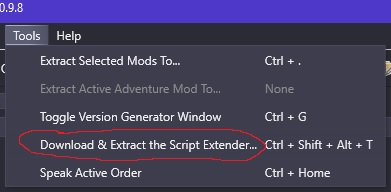

# Installing Mods using BG3ModManager
This page is based on [this](https://docs.google.com/document/d/16wq-ImbnHuHTO7Kzi7OZysZCJ1F_jVbXrwdxtB3h53Y/edit#heading=h.xk8qvx6nx9az) wonderful guide by Maze on Discord. As such, the guide is for installing bg3modmanager(not Vortex) on the Steam version of the game.

If you have any issues following this guide, your best bet is to join the Larian Studios Discord server and go to #bg3-mods-support.

*Disclaimers:  
Please note: there is currently no official support for mods from Larian Studios.  
I am not responsible for breaking your game - this is at your own risk. Whenever you choose to follow a guide or mod your game, know there are certain risks that exist such as your save breaking, your game breaking or other stuff. Which can be fixed by verifying or reinstalling the game.*

## Getting Started
1. Open up the github page for BG3 Mod Manager which can be found [here](https://github.com/LaughingLeader/BG3ModManager).
2. Make sure you have run your game at least once to generate the necessary files.
3. To get the latest version, scroll down to "Setup" and press "Grab the latest release."
   
   
   After selecting this option, it will download a zip file.
   
   
   Extract the zip file, and delete the compressed version since we no longer need it.
   
   
4. Move the extracted folder somewhere you will remember, the desktop is always a good bet.
   * Do ***not*** place it in the game folder, or in any folders such as the Larian Studios in AppData. You will break something.

   * Do ***not*** remove the .exe or any of the files in the folder. Only move the folder in its entirety. They are all required for the mod manager to function properly.
   

## Setting Up the Mod Manager

1. If you have not already done so, make sure you have opened the game at least once since you installed it, and then close the game.
2. Open the Bg3ModManager application from the extracted folder in the previous section. You should see something like this: 
   
   * If you get a big red error message at the bottom mentioning that it can't access certain files, make sure that the mod manager folder is not being managed by OneDrive.
3. Check that the profiles are correct. You should see something like this:
   
   * If they are blank, see Step 1, then close and reopen the mod manager.
4. Go into Settings -> Preferences. The preferences menu looks like this:
   
5. The two areas to note here are __Game Data Path__ and __Game Executable Path__. This must both be set properly for the Mod Manager to function.  
*Make sure to save your preferences after completing this section and closing the window!*
   * Common values for these are:  
    **Data**: C:\Program Files (x86)\Steam\steamapps\common\Baldurs Gate 3\Data  
    **Executable**: C:\Program Files (x86)\Steam\steamapps\common\Baldurs Gate 3\bin\bg3.exe  
    
   * You can check this for yourself by going into to steam and selecting "Browse Local Files"
   

Your Mod Manager should now be configured properly! Continue to the next section for how to install mods from Nexus. Specifically, mods that are .pak files. Loose file mods will come later.

### Setting up bg3 Script Extender (Optional)
One of the most common dependencies for mods these days is the Script Extender. In short, it allows modders greater access to things within the game. Thankfully, bg3MM has an easy way to add this to your set up. Go to Tools-> Download and Extract Script Extender. It will automatically grab the files you need and put them in the correct places. The script extender automatically updates itself, so you should only have to do this the one time.

## Installing .pak Mods
1. The first thing you do is go to https://www.nexusmods.com/ and find a mod you want to install. 
2. Once you find a mod you would like to download, go to the Files tab of the mod, and click __Manual Download__, *not* Mod Manager Download. Mod Manager download is for Vortex *only*.
   
3. Once you click Manual Download, it will pop up a screen with options "Slow Download" and "Fast Download." If you have a premium Nexus account, select Fast, otherwise select Slow.
4. Once the file finishes downloading, extract it.
   * A good tool for this is [7zip](https://7-zip.org/) because sometimes the files you download will be .rar or .7z instead of .zip, and this tool can extract those file types.
5. Once the file is extracted, go into the new folder and find the .pak file.
     
   Once you locate the file, open up your Mod Manager, and select File -> Import Mod. Select the .pak, and then click Open.
   
6. After you import, the mod will be in the inactive side, like this:
   
   
   Drag and drop the mod into the active side, so it looks like this:
   
   
   *Some mods will be orange-y and go down into the Overrides section. Leave them there.*
7. After dragging all the mods into the Active side, click the Save Load Order button(You can also use the Export Load Order button, they do the same thing.)  
   
   
   Notes:
   * When you hit this button, you should see a green message appear at the bottom saying it was sucessful. If it was not successful, please go to the Larian Studios Discord channel #bg3-mods-support and ask for assistance.
   * A common issue with mods showing as enabled but not actually working in game is the case of there being extraneous files in the mods folder.  
    To make sure this is not the case, the *only* thing in the mods folder should be *.pak files.  
    No other files should be present, and no folders of any kind. ***Only .pak files.***

## Installing Manual (Loose file) Mods

Manual, or Loose file mods are ones that do not come with a *.pak file. Usually it will be a zip archive with a single folder named "Data" in it. These are essentially mods that directly modify the game files in some way. These cannot be managed by BG3MM, and so be careful with adding too many at one time as it will become hard to debug any issues.

There are three common places for these to be installed:

1. Dropping the files into: `..\common\Baldurs Gate3\Data`
2. Dropping them into:      `..\common\Baldurs Gate3\bin`
3. Dropping them into:      `..\common\Baldurs Gate3\`

Once you find the correct destination, simply drag and drop the folder into the correct location. Make sure you drag the Data/Generated/etc folder, not the entire directory for the mod itself.

Whichever method is the correct one really depends on what mod you're trying to install. The best place to check if you don't know for certain is the mod's Description on Nexus.

*Note: Some mods such as Party Limit Begone and Native Mods have a different process that you will need to make sure you read before installing.*