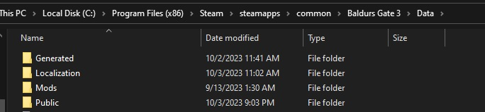
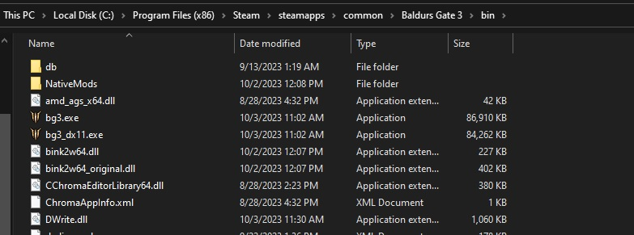
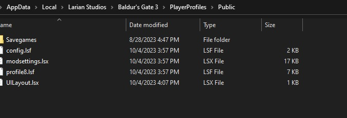
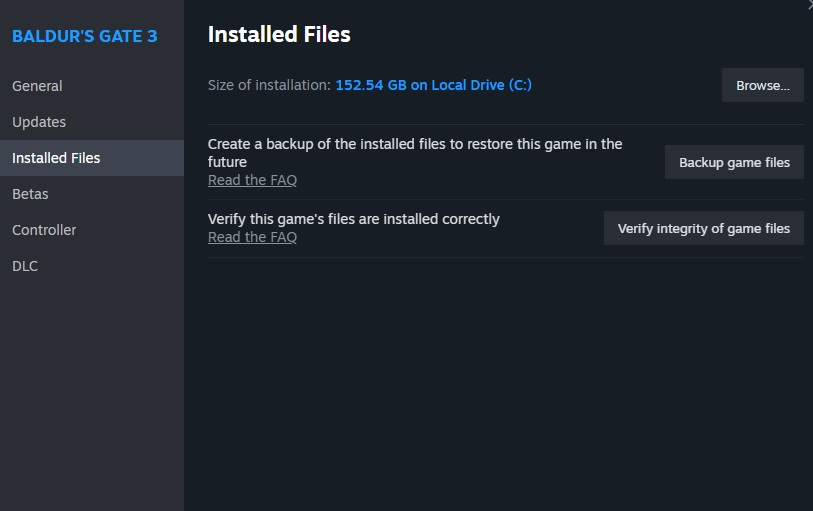

# Resetting the modsettings.lsx File

Sometimes when you're having issues with crashes or mods not working properly, you have to reset your modsettings.lsx file. The following steps will walk you through this process.

1. Either delete or move all of your mods out of the mods folder. There are a few ways to find this folder. 
   * If you use bg3modmanager, you can open that, and along the top select Go -> Open Mods Folder.
   * You can also get there by putting `%LOCALAPPDATA%\Larian Studios\Baldur's Gate 3\Mods` in the path bar in Windows Explorer.
   * If you opt to move the mods rather than delete, make sure to put them somewhere like Documents or your Desktop.
2. Go to the installtion Data folder for BG3, often found at `C:\Program Files (x86)\Steam\steamapps\common\Baldurs Gate 3\Data` however yours may be different. 
   * Once you get here, you should see several files and folders. You will only be deleting the following folders **if you have them**:
     * Generated
     * Mods
     * Public
    
    ***Do not delete anything besides the 3 folders listed or you will have to verify/reinstall most of your game***
    
3. Next, delete all folders in the `bin` folder which can generally be found at `C:\Program Files (x86)\Steam\steamapps\common\Baldurs Gate 3\bin` however your specific path may be different. If you do not have any folders, skip this step.
   * Examples of folders that may be found here:
     * Native Mods
     * db
4. While still inside the `bin` folder, also do the following:
   * If you installed the ScriptExtender, or think you might have:
     * Locate and delete `DWrite.dll`  
   * If you installed the Native Mod Loader: 
     * Delete `bink2w64.dll`
     * Rename `bink2w64_original.dll` to `bink2w64.dll`

    

   *Note: Don't panic if you cant find some of these, you may not have them.*

   ***Warning: If you installed the Party Limit Begone mod, you must also delete all of the `*.exe` files in the folder as well.***
5. Delete `modsettings.lsx` which can generally be found at `%LOCALAPPDATA%\Larian Studios\Baldur's Gate 3\PlayerProfiles\Public`. 
   
6. Verify your game files through Steam.
   * To do this in Steam:
     * Right click Baldur's Gate, and select Properties. Then go to the Installed Files section and select verify.
    
   * If you do not use Steam, look up the correct way to do this for your platform.
7. Wait for the verification to be done, do not worry if a bunch of files need to be replaced, thats normal.
8. Open up the game without installing any mods and try to get into character creation and the nautiloid. If everythign went according to plan this should work without issue!